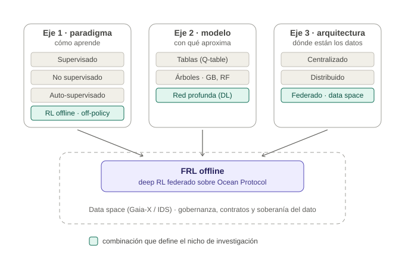
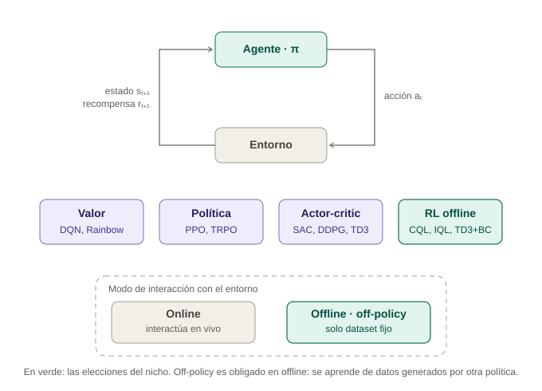
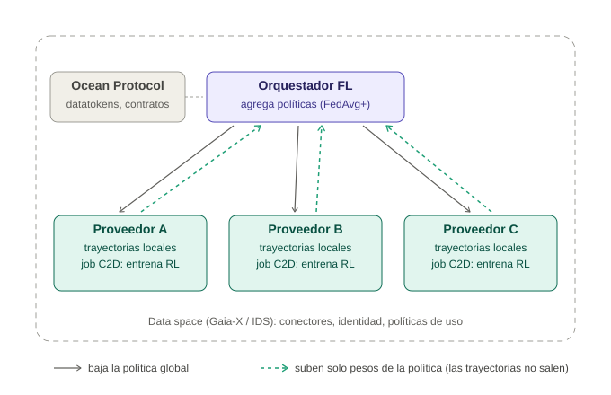
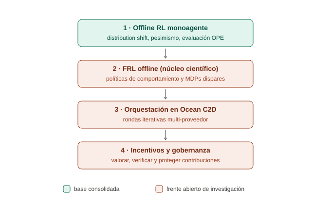

# Retos de investigación: Deep Learning + RL offline (off-policy) sobre arquitectura federada basada en data spaces con Ocean Protocol

> **Nicho:** entrenar políticas de **deep reinforcement learning** en modo **offline** y **off-policy**, de forma **federada** entre múltiples proveedores de datos soberanos, dentro de un **data space** (estilo Gaia-X / IDS), usando **Ocean Protocol** (Compute-to-Data, datatokens, smart contracts) como capa tecnológica de acceso, cómputo e incentivos.
>
> **Tesis de este documento:** el reto no está en una sola capa, sino en que cada capa de la pila añade un problema abierto — y la **intersección vertical completa está vacía** en la literatura.

---

## 1. Definición del nicho: la celda en el cruce de tres ejes

El nicho no es una rama de un árbol taxonómico, sino la intersección de una elección en cada uno de tres ejes ortogonales: el paradigma (cómo se aprende), la familia de modelo (con qué se aproxima) y la arquitectura (dónde están los datos).

Las elecciones del nicho y su justificación:

| Eje | Elección | Por qué |
|---|---|---|
| Paradigma | RL **offline**, **off-policy** | Los proveedores de un data space (hospitales, energéticas, industria) no pueden permitir exploración en vivo; solo disponen de **trayectorias históricas**. Off-policy es además matemáticamente obligado: en offline se aprende de datos generados por *otra* política (la de comportamiento). |
| Modelo | Red neuronal profunda (DL) | Espacios de estado complejos requieren aproximación de funciones; y la federación vía promediado de pesos (FedAvg) exige parámetros continuos promediables (los árboles tipo Gradient Boosting quedan descartados por esto). |
| Arquitectura | Federada sobre data space + Ocean | Los datos son sensibles, están en silos de dueños distintos y no pueden centralizarse. Ocean aporta el mecanismo *compute-to-data* y la capa de mercado/contratos. |

## 2. Recordatorio del objeto que se federa

Lo que viaja entre participantes no son datos sino los **pesos de la red** que representa la política π (o la función Q). El siguiente esquema sitúa las elecciones del nicho dentro del paradigma RL.

Algoritmos candidatos para la parte local: **CQL** (Conservative Q-Learning), **IQL** (Implicit Q-Learning), **TD3+BC**, **BCQ**, o enfoques de modelado de secuencias como **Decision Transformer**. Todos son offline y off-policy, y todos parametrizan con redes profundas: federables vía agregación de pesos.

## 3. La arquitectura objetivo

Cada proveedor publica su dataset de trayectorias en el data space; el entrenamiento local se ejecuta como un **job de Compute-to-Data (C2D)** junto al dato; solo los pesos de la política resultante suben al orquestador, que los agrega y redistribuye en rondas sucesivas. Ocean aporta el control de acceso (datatokens), los contratos inteligentes y el registro auditable; el data space aporta identidad, conectores y políticas de uso.

## 4. La pila de retos

Cada capa hereda los retos de la anterior y añade los suyos. La capa 1 está relativamente consolidada (es la caja de herramientas); las capas 2, 3 y 4 son frentes abiertos.

---

### 4.1 Capa 1 — Offline RL monoagente (base consolidada, pero con cabos sueltos)

Estos retos están bien caracterizados en la literatura (Levine et al., 2020; Kumar et al., 2020). No son la contribución de la tesis, pero condicionan todo lo demás:

1. **Distribution shift.** La distribución de visitas estado-acción de la política aprendida difiere de la de la política de comportamiento que generó el dataset. Evaluar acciones fuera de distribución (OOD) con una Q-network produce sobreestimaciones catastróficas.
2. **El principio de pesimismo y su calibración.** La respuesta estándar (CQL y familia) penaliza el valor de acciones no vistas. El reto fino: cuánto pesimismo aplicar. Demasiado → la política se limita a imitar el dataset; demasiado poco → explota errores de extrapolación.
3. **Calidad y cobertura del dataset.** El rendimiento depende críticamente de cuán bien el dataset cubre el espacio estado-acción, y en particular de si cubre las trayectorias de la política óptima.
4. **Evaluación de políticas offline (OPE).** Sin poder interactuar con el entorno, ¿cómo sabes si la política aprendida es buena antes de desplegarla? La off-policy evaluation (importance sampling, FQE, doubly robust) sigue teniendo alta varianza. Este reto reaparece amplificado en la capa 2: el orquestador necesita evaluar contribuciones sin entorno.
5. **Sensibilidad a hiperparámetros sin validación posible.** Sin entorno de validación, la selección de modelo en offline RL es en sí misma un problema abierto.

### 4.2 Capa 2 — FRL offline: el núcleo científico del reto

Literatura muy joven (2022–2024: FEDORA en NeurIPS, variantes federadas de Q-learning con pesimismo, regímenes de tratamiento dinámico federados en salud). El hallazgo central del área: **combinar ingenuamente FedAvg con un algoritmo de offline RL no funciona bien**. Los retos específicos:

1. **Heterogeneidad de políticas de comportamiento (ensemble heterogeneity).** En FL supervisado los clientes difieren en datos; aquí difieren además en *quién generó esos datos*: cada dataset local fue recogido por una política de comportamiento distinta, con distinto nivel de competencia. Promediar a ciegas la política de un cliente con datos "expertos" con la de uno con datos "aleatorios" arrastra al modelo global hacia abajo. Se necesitan mecanismos de ponderación por calidad (FEDORA, por ejemplo, decae la confianza en cada dataset según la calidad de la política que es capaz de generar).
2. **Heterogeneidad de entornos (MDPs distintos).** Es el no-IID llevado al extremo: cada silo puede tener dinámicas, distribuciones de estados e incluso funciones de recompensa diferentes. ¿Qué significa siquiera "una política global óptima" cuando los MDPs locales difieren? Esto conecta con la personalización federada (representación compartida + cabezas locales).
3. **Agregación del pesimismo.** Cada cliente calcula penalizaciones de incertidumbre respecto a *su* dataset local. Al agregar: ¿el pesimismo global debe ser la intersección (muy conservador), la unión (peligrosamente optimista) o algo intermedio basado en cobertura colectiva? La teoría reciente sugiere que basta la **cobertura colectiva de una sola política** (los datasets, en conjunto, cubren la política óptima aunque ninguno lo haga por separado) — formalizar y explotar esto con redes profundas es terreno abierto.
4. **No estacionariedad de la pérdida.** Las pérdidas de RL son no estacionarias (los objetivos TD cambian con la propia red). Promediar pesos de redes Q en fases distintas de aprendizaje es más frágil que en supervisado: inestabilidad de convergencia, interferencia destructiva entre actualizaciones.
5. **Garantías teóricas.** Cotas de convergencia y de sub-optimalidad para FRL offline con aproximación de funciones profundas: prácticamente inexistentes (los resultados teóricos actuales son para Q-learning tabular o lineal).
6. **Evaluación federada de políticas.** El reto OPE de la capa 1 al cuadrado: el orquestador debe estimar la calidad de cada política cliente y de la global sin acceso ni a los entornos ni a los datasets.
7. **Ausencia de benchmarks.** No existe un D4RL federado estándar (datasets offline particionados de forma realista, no-IID, con políticas de comportamiento heterogéneas por cliente). Crear uno ya es una contribución.

### 4.3 Capa 3 — Orquestación sobre Ocean Compute-to-Data: el núcleo ingenieril

Ocean C2D fue diseñado para **trabajos de cómputo puntuales sobre el dato de un proveedor**; el FRL necesita **rondas iterativas sincronizadas entre muchos proveedores**. De ese desajuste nacen los retos:

1. **Iteratividad y estado.** Una ronda de FL implica: bajar el modelo global → entrenar localmente → subir pesos → agregar → repetir decenas o cientos de veces. C2D ejecuta jobs efímeros en contenedores (clústeres Kubernetes del proveedor). Hay que diseñar cómo persistir y versionar el estado del modelo entre rondas, cómo encadenar jobs, y cómo pasar el modelo global como *input asset* de cada nuevo job.
2. **Orquestación multi-proveedor.** C2D opera proveedor a proveedor; el orquestador FL debe coordinar N proveedores en paralelo, gestionar asincronía (jobs que tardan distinto), fallos, *stragglers* y reintentos, manteniendo coherencia de la ronda.
3. **Orquestador centralizado = punto de fuga y de fallo.** Si una entidad central orquesta los jobs entre silos, hacia ella pueden filtrarse metadatos e información de los pesos. La orquestación descentralizada (peer-to-peer, o vía smart contracts) es la dirección propuesta en el ecosistema, pero no existe un diseño de referencia para FL iterativo, y menos para RL.
4. **Coste y latencia.** Cada ronda puede implicar transacciones on-chain (acceso vía datatokens, registro), arranque de contenedores y transferencia de modelos. Con cientos de rondas, el coste económico y temporal puede ser prohibitivo. Retos: minimizar rondas (entrenamiento local más largo, compresión de modelos, agregación jerárquica), decidir qué va on-chain y qué off-chain.
5. **Confianza en el entorno de ejecución.** ¿Cómo sabe el consumidor del algoritmo que el proveedor ejecutó el entrenamiento correctamente, y cómo sabe el proveedor que el algoritmo no exfiltra datos? Sandboxing de algoritmos, allow-lists de algoritmos confiables, y potencialmente TEEs (enclaves de ejecución confiable) o pruebas de cómputo verificable.
6. **Interoperabilidad con el data space.** Armonizar los flujos C2D de Ocean con los conectores y políticas de uso de Gaia-X/IDS (el puente existe en ecosistemas como Pontus-X/deltaDAO, pero no hay un patrón arquitectónico estandarizado para FL, y ninguno para FRL).

### 4.4 Capa 4 — Incentivos, seguridad y gobernanza: el reto socio-económico

Ocean añade lo que los papers de FRL ignoran por completo: un **mercado** con actores económicos racionales. Retos:

1. **Valoración de contribuciones de trayectorias.** ¿Cuánto vale el dataset de un proveedor? En supervisado se aproxima con métodos tipo Shapley; en RL el valor depende de la **cobertura del espacio estado-acción** y de la **calidad de la política de comportamiento** — exactamente lo que la capa 2 dice que es difícil de estimar. Diseñar mecanismos de reparto de recompensas (tokenomics) justos, computables y resistentes a manipulación es un problema abierto y de alto impacto.
2. **Free-riding y participación estratégica.** Sin valoración fiable, un proveedor puede aportar datos basura y cobrar igual, o beneficiarse del modelo global sin contribuir. El diseño de mecanismos (teoría de juegos + FL) está poco explorado para RL.
3. **Envenenamiento de políticas (policy poisoning).** Un cliente malicioso puede subir pesos que sesguen la política global hacia comportamientos peligrosos — en RL las consecuencias son acciones en el mundo, no solo clasificaciones erróneas. Las defensas de agregación robusta (Krum, mediana, recorte) están pensadas para supervisado; su comportamiento con pérdidas RL no estacionarias apenas se ha estudiado.
4. **Privacidad residual de los pesos.** Los pesos/gradientes filtran información (ataques de inversión y de pertenencia); con trayectorias, pueden filtrar comportamientos individuales (rutas de un vehículo, hábitos de consumo, decisiones clínicas). Se necesitan privacidad diferencial (con su coste en rendimiento, agravado por la fragilidad del RL), agregación segura o cifrado homomórfico — y cuantificar el trade-off privacidad/rendimiento en FRL offline está sin hacer.
5. **Gobernanza híbrida Web3 ↔ data spaces europeos.** Ocean es permissionless y cripto-económico; Gaia-X/IDS son permissioned, contractuales y orientados a cumplimiento (RGPD, Data Act, AI Act). Armonizar contratos de uso ejecutables con smart contracts y tokenomics, definir responsabilidad legal sobre una política entrenada colectivamente, y auditar el ciclo de vida del modelo, es terreno casi virgen.
6. **Reproducibilidad y auditoría del modelo.** Para dominios regulados: trazar qué datos (sin verlos) y qué rondas produjeron la política desplegada, usando el registro on-chain como evidencia de auditoría.

---

## 5. Matriz resumen: retos × madurez × preguntas de investigación

| # | Reto | Capa | Madurez | Pregunta de investigación asociada |
|---|---|---|---|---|
| R1 | Distribution shift y pesimismo | 1 | Alta (herramientas: CQL, IQL) | ¿Qué algoritmo offline local es más robusto como base federable? |
| R2 | Evaluación offline (OPE) | 1→2 | Media | ¿Cómo estimar la calidad de políticas cliente sin entorno ni datos? |
| R3 | Políticas de comportamiento heterogéneas | 2 | Baja | ¿Cómo ponderar/filtrar clientes según la calidad de su política generadora? |
| R4 | MDPs heterogéneos y personalización | 2 | Baja | ¿Global única o representación compartida + cabezas locales? |
| R5 | Agregación del pesimismo | 2 | Muy baja | ¿Cómo combinar penalizaciones de incertidumbre locales con garantías de cobertura colectiva? |
| R6 | Teoría de convergencia (deep) | 2 | Muy baja | ¿Cotas de sub-optimalidad para FRL offline con aproximación profunda? |
| R7 | Benchmark federado offline | 2 | Inexistente | ¿Cómo particionar D4RL/NeoRL de forma realista y no-IID? |
| R8 | Rondas iterativas sobre C2D | 3 | Muy baja | ¿Qué patrón arquitectónico encadena jobs C2D con estado de modelo versionado? |
| R9 | Orquestación descentralizada | 3 | Baja | ¿Puede un smart contract coordinar rondas sin punto central de fuga? |
| R10 | Coste/latencia on-chain | 3 | Baja | ¿Qué división on-chain/off-chain minimiza coste por ronda? |
| R11 | Verificación del cómputo | 3 | Baja | ¿TEEs, allow-lists o pruebas verificables para jobs de entrenamiento RL? |
| R12 | Valoración de trayectorias e incentivos | 4 | Muy baja | ¿Mecanismo tipo Shapley computable para datasets de trayectorias? |
| R13 | Poisoning de políticas | 4 | Muy baja | ¿Funcionan Krum/mediana con pérdidas RL no estacionarias? |
| R14 | Privacidad residual (DP + RL) | 4 | Baja | ¿Trade-off privacidad/rendimiento de DP-SGD en CQL federado? |
| R15 | Gobernanza Web3 ↔ Gaia-X/IDS | 4 | Muy baja | ¿Cómo mapear políticas de uso IDS a smart contracts de Ocean para FL? |

## 6. Lectura estratégica: dónde posicionar la contribución

La distribución del reto: **científicamente**, el corazón está en la capa 2 (R3–R7: agregación bajo heterogeneidad de políticas de comportamiento y MDPs — abierto incluso sin blockchain); **ingenierilmente**, en la capa 3 (R8–R9: nadie ha llevado FRL offline real a C2D iterativo multi-proveedor); **como diferencial socio-técnico**, en la capa 4 (R12 es probablemente el reto más original que habilita Ocean frente a un FL "clásico").

Recomendación metodológica: elegir **una** capa como contribución principal y tratar las demás como ingeniería de soporte. Tres posicionamientos viables de tesis:

1. **Tesis algorítmica (capa 2):** un algoritmo de FRL offline robusto a heterogeneidad de políticas de comportamiento, evaluado en un benchmark federado propio (R3+R5+R7), con Ocean como plataforma de demostración.
2. **Tesis arquitectónica (capa 3):** una arquitectura de referencia para FL/FRL iterativo sobre C2D en data spaces Gaia-X, con análisis de coste, latencia y privacidad (R8+R9+R10), usando algoritmos de capa 2 existentes (p. ej., FEDORA o CQL+FedAvg).
3. **Tesis de mecanismos (capa 4):** valoración e incentivación de contribuciones de trayectorias en mercados de datos descentralizados para RL (R12+R2), con prototipo sobre Ocean.

En los tres casos, un caso de uso europeo ancla el trabajo: comunidades energéticas (espacio de datos de energía), movilidad, o regímenes de tratamiento dinámico en salud (EHDS) — todos con trayectorias sensibles, exploración en vivo inviable y múltiples dueños del dato: el escenario exacto del nicho.

## 7. Referencias de partida

1. Levine, S., Kumar, A., Tucker, G., Fu, J. (2020). *Offline Reinforcement Learning: Tutorial, Review, and Perspectives on Open Problems.* arXiv:2005.01643.
2. Kumar, A. et al. (2020). *Conservative Q-Learning for Offline Reinforcement Learning (CQL).* NeurIPS.
3. Rengarajan, D. et al. (2023/2024). *FEDORA: Federated Ensemble-Directed Offline Reinforcement Learning.* arXiv:2305.03097 (NeurIPS).
4. *Federated Offline Reinforcement Learning: Collaborative Single-Policy Coverage Suffices.* arXiv:2402.05876.
5. Zhou, D. et al. (2024). *Federated Offline Reinforcement Learning* (regímenes de tratamiento dinámico). JASA / arXiv:2206.05581.
6. Qi, J. et al. (2021). *Federated Reinforcement Learning: Techniques, Applications, and Open Challenges.* arXiv:2108.11887.
7. Kairouz, P. et al. (2021). *Advances and Open Problems in Federated Learning.* Foundations and Trends in ML.
8. McMahan, B. et al. (2017). *Communication-Efficient Learning of Deep Networks from Decentralized Data (FedAvg).* AISTATS.
9. Ocean Protocol — documentación de Compute-to-Data y arquitectura: https://docs.oceanprotocol.com
10. McConaghy, T. *How Does Ocean Compute-to-Data Relate to Other Privacy-Preserving Approaches?* (blog de Ocean Protocol).
11. deltaDAO — casos de uso de Ocean Protocol en contexto Gaia-X (Pontus-X): https://github.com/deltaDAO/Ocean-Protocol-Use-Cases
12. International Data Spaces Association — *Reference Architecture Model (IDS-RAM 4)*; Gaia-X — *Architecture Document*.
13. Fu, J. et al. (2020). *D4RL: Datasets for Deep Data-Driven Reinforcement Learning.* arXiv:2004.07219 (base para construir el benchmark federado).
